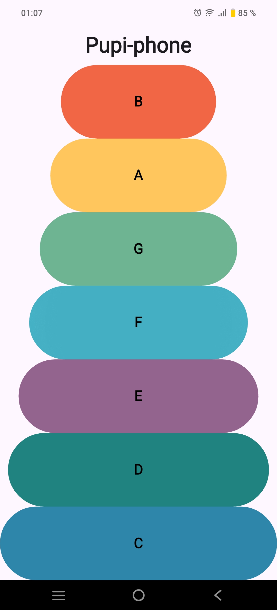

Flutter Xylophone App

**Pupi-phone** is a simple and fun musical xylophone app built with Flutter. Tap colorful buttons to play musical notes from C to B. Great for beginners learning Flutter or kids exploring musical sounds!

  

## 🚀 Features

- Colorful buttons for each musical note (C, D, E, F, G, A, B)
- Smooth, responsive UI
- Plays corresponding sound when a note is tapped
- Simple and beginner-friendly Flutter layout

## 🛠 Built With

- **Flutter** – UI toolkit for building beautiful apps
- **Dart** – Programming language used with Flutter
- **Audio Assets** – Local `.wav` files played with `audioplayers` package
